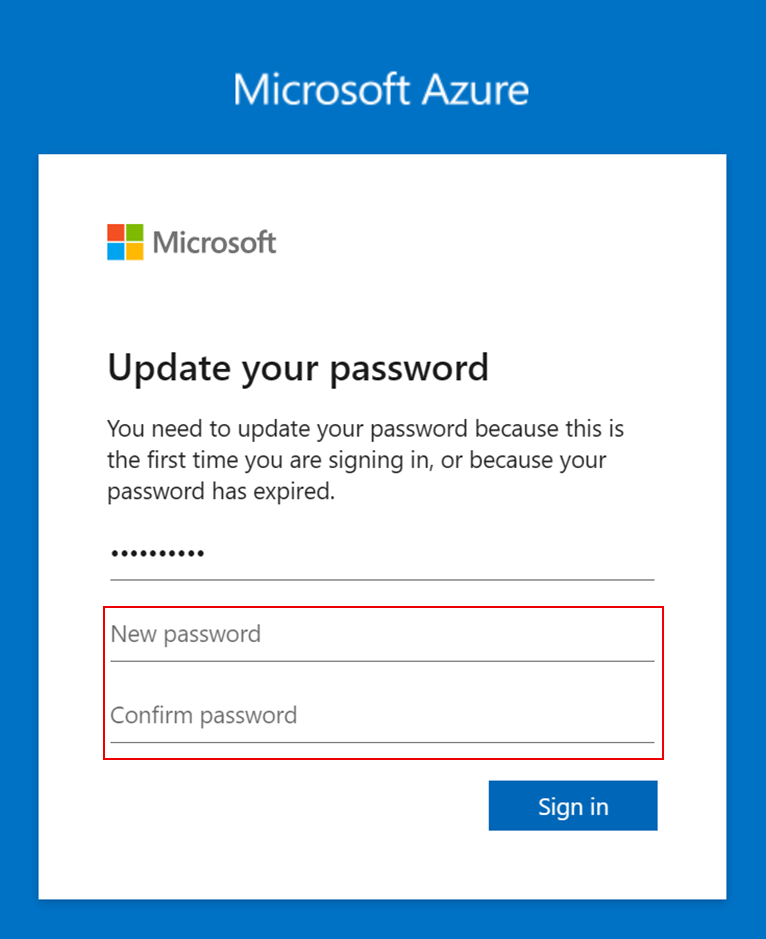

# 1. 사전 준비

### Authenticator 애플리케이션 설치

Azure 서비스를 `Entra ID(구 Microsoft Azure AD)`를 통해 사용하려면 `다단계 인증(MFA)`이 필요합니다.

MFA는 계정 보안을 강화하기 위한 필수 절차이며, 이를 위해 **Microsoft Authenticator 앱** 설치가 필요합니다.

다음 안내에 따라 사용 중인 모바일 기기에 Authenticator 앱을 설치해 주세요:

- Android : [https://play.google.com/store/apps/details?id=com.azure.authenticator&pli=1](https://play.google.com/store/apps/details?id=com.azure.authenticator&pli=1)
- iOS : [https://apps.apple.com/us/app/microsoft-authenticator/id983156458](https://apps.apple.com/us/app/microsoft-authenticator/id983156458)

### Azure Portal 접속

1. [Azure Portal](https://portal.azure.com)에 접속합니다.
2. 사전에 전달받은 계정 혹은 개인 계정을 사용해 로그인합니다.
3. 패스워드 업데이트를 진행합니다.
    
    
    
4. 다단계 인증(MFA) 구성을 위해 `Next` 버튼을 클릭합니다.
5. `Next` 버튼을 눌러 구성을 시작합니다.
    
    
    
6. 모바일에서 Authenticator 앱을 실행하고, 앱 상단의 `+` 버튼을 클릭합니다.
    
    
    
7. 계정 추가 화면에서 `회사 또는 학교 계정`을 선택합니다.
8. `QR 코드 스캔`을 선택하고 브라우저의 QR 코드를 인식합니다.
    
    
    
9. 인식이 완료되면 자동으로 페이지가 넘어가며 모바일 Authenticator 앱에서 브라우저에 표시된 숫자를 입력해 줍니다.
10. 인증이 완료되면 `Next` 버튼, `Done` 버튼을 클릭하여 구성을 완료합니다.
    
    
    

## Azure Portal 설정

**언어 설정**

1. 상단 메뉴 오른쪽 톱니 바퀴 모양 `설정 버튼`을 클릭합니다.
    
    
    
2. 왼쪽 메뉴에서 `Language + region`을 선택합니다.
3. Language에서 `한국어`를 선택한 뒤 `Apply` 버튼을 클릭합니다.
4. 오른쪽 상단 `X` 버튼을 클릭합니다.

**구독 확인**

1. 상단 메뉴 검색창에서 `구독`을 입력하고 선택하여 구독 화면으로 이동합니다.
    
    
    
2. 구독 리스트가 보이고 활성 상태인지 확인합니다.