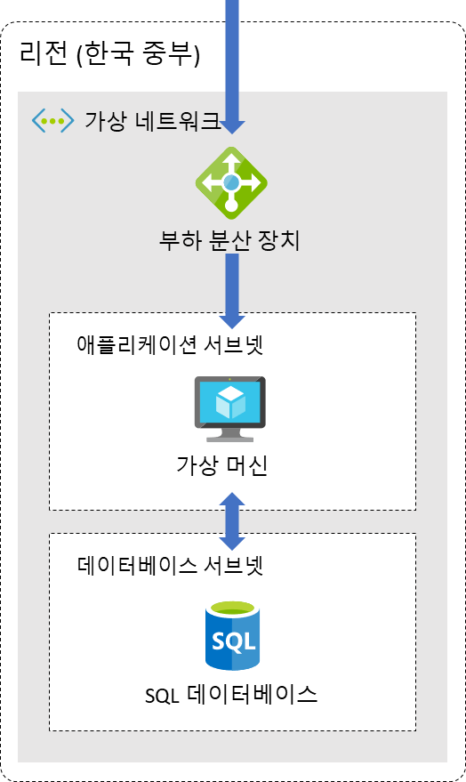

# Advanced

이번 실습에서는 애저에서 가장 기본적인 형태의 웹 애플리케이션을 배포하는 방법에 대해 알아보도록 하겠습니다. 가상 머신에 웹 애플리케이션을 배포하고 웹 애플리케이션의 데이터를 관리하기 위한 SQL 데이터베이스를 구성해 보도록 하겠습니다. 부하 분산 장치의 프런트 엔드 IP를 웹 애플리케이션을 진입점으로 사용하고 가상 머신을 백 엔드 풀로 사용합니다. 이렇게 구성하면 웹 애플리케이션을 논리적으로 격리할 수 있으며, 추후 애플리케이션의 확장을 고려한 아키텍처를 설계할 수 있습니다.



### 실습 내용

- 가상 네트워크 만들기
- 부하 분산 장치 만들기
- NAT 게이트웨이 만들기
- 웹 애플리케이션 배포
    - 가상 머신 만들기
    - 베스천 설정
    - 웹 애플리케이션 배포
    - 배포 테스트
- SQL 데이터베이스 연동
    - SQL 데이터베이스 서버 만들기
    - SQL 데이터베이스 만들기
    - 데이터베이스 엔드포인트 만들기
    - SQL 데이터베이스 연동

## 가상 네트워크 만들기


1. 왼쪽 상단 검색창에서 `가상 네트워크` 입력하여 가상 네트워크 화면으로 이동합니다.
2. `만들기` 버튼을 클릭합니다.
3. 아래와 같이 구성하고 `다음: IP 주소` 버튼을 클릭합니다.


- 구독 : 생성한 구독 선택
- 리소스 그룹 : 새로 만들기 버튼 클릭 후, BasicWorkshopRG 입력하고 `확인` 버튼 클릭
- 이름 : BasicVNet
- 지역 : KoreaCentral

1. 아래와 같이 구성된 것을 확인하고 `검토 + 만들기` 버튼을 클릭합니다.


1. `만들기` 버튼을 클릭하여 가상 네트워크를 생성합니다.

## 부하 분산 장치 만들기


1. 왼쪽 상단 검색창에서 `부하 분산 장치` 입력하여 부하 분산 장치 화면으로 이동합니다.
2. `만들기` 버튼을 클릭합니다.
3. 아래와 같이 구성합니다.


- 구독 : 생성한 구독 선택
- 리소스 그룹 : BasicWorkshopRG
- 이름 : todoLB
- 지역 : Korea Central
- SKU : 표준
- 형식 : 공개
- 계층 : 지역
1. `다음: 프런트 엔드 IP 구성` 버튼을 클릭합니다.
2. `프런트 엔드 IP 구성 추가` 버튼을 클릭하고 아래와 같이 구성 후, `추가` 버튼을 클릭합니다.


- 이름 : todoPublic
- IP 버전 : IPv4
- IP 유형 : IP 주소
- 공용 IP 주소 : `새로 만들기` 버튼 클릭
    - 이름 : todoPublicIP

1. `다음: 백 엔드 풀` 버튼을 클릭하고 `백 엔드 풀 추가`를 클릭합니다.
2. 아래와 같이 구성하고 `저장` 버튼을 클릭합니다.


- 이름 : TodoBackend
- 가상 네트워크 : BasicVNet(BasicWorkshopRG)
- 백 엔드 풀 구성 : IP 주소

1. `다음: 인바운드 규칙` 버튼을 클릭합니다.
2. 부하 분산 규칙을 생성하여 적용해 보도록 하겠습니다. `부하 분산 규칙 추가` 버튼을 클릭하고 다음과 같이 구성합니다.


1. 상태 프로브는 백 엔드 풀의 정상 상태를 확인합니다. 상태 프로브에서 `새로 만들기`를 클릭하고 다음과 같이 설정하고 `확인` 버튼을 클릭합니다.


1. TodoRule이 정상적으로 추가된 것을 확인한 뒤, `검토 + 만들기` 버튼을 클릭하고 `만들기` 버튼을 클릭하여 부하 분산 장치를 생성합니다.

## 웹 애플리케이션 배포

### 가상 머신 만들기


1. 왼쪽 상단 검색창에서 `가상 머신` 입력하여 가상 머신 화면으로 이동합니다.
2. `만들기` 버튼을 클릭하고 Azure 가상 머신을 선택합니다.


1. 아래와 같이 구성하고 `네트워킹` 탭을 선택하거나 `다음: 디스크, 다음: 네트워킹`을 차례로 선택합니다.


- 구독 : 생성한 구독 선택
- 리소스 그룹 : BasicWorkshopRG
- 가상 머신 이름 : TodoVM
- 지역 : (Asia Pacific) Korea Central
1. 네트워킹 탭에서 다음 정보를 선택하거나 입력합니다.


- 가상 네트워크 : BasicVNet
- 서브넷 : `서브넷 구성 관리` 클릭
    - `서브넷` 버튼 클릭
    - 이름 : applicationSubnet
    - 서브넷 주소 범위 : 10.0.1.0/24
    - `저장` 버튼 클릭
    - 오른쪽 상단 `x` 버튼 클릭
    - `applicationSubnet` 선택
- 공용 IP : 없음
- NIC 네트워크 보안 그룹 : 고급

1. 부하 분산에서 `기존 부하 분산 솔루션 뒤에 이 가상 머신을 배치하겠습니까?` 체크박스를 클릭하고 아래와 같이 구성합니다.


- 부하 분산 옵션 : Azure Load Balancer
- 부하 분산 장치 선택 : todoLB
- 백 엔드 풀 선택 : TodoBackend

1. `네트워크 보안 그룹 구성에서 새로 만들기를 클릭합니다. (중요)`
2. 인바운드 보안 규칙 추가를 클릭하고 다음과 같이 설정 후 추가 버튼을 클릭합니다.


1. `검토 + 만들기` 버튼을 클릭하고 설정을 검토한 다음 `만들기`를 선택합니다. 새 키 쌍 생성 화면이 뜨면 `프라이빗 키 다운로드 및 리소스 만들기` 버튼을 클릭합니다.


### 베스천 배포하기

1. `가상 머신 화면`에서 TodoVM1을 클릭하고, 왼쪽 `베스천` 메뉴를 클릭합니다.
2. `기본값을 사용하여 Azure Bastion …` ****버튼을 클릭합니다.


### 웹 애플리케이션 배포

베스천을 사용하여 웹 애플리케이션을 배포해 보도록 하겠습니다.

1. 베스천이 생성되면 아래 정보를 입력하고 연결 버튼을 클릭합니다.


1. 아래 명령어를 사용하여 깃허브에서 `TodoApp` 리포지토리를 복제합니다.

```bash
git clone https://github.com/Anna-Jeong-MS/TodoApp.git
```

1. `TodoApp`을 실행하기 위해 몇 가지 파이썬 종속성을 설치해야 합니다. 파이썬 종속성 설치하기 위해 파이썬 종속성을 설치하기 위한 도구인 `pip`를 설치합니다.

```bash
sudo apt update && sudo apt install python3-pip
```

1. 이제 `TodoApp`을 실행하기 위한 종속성을 다운로드 받습니다.

```bash
sudo pip install fastapi
sudo pip install "uvicorn[standard]"
sudo pip install aiofiles
sudo pip install pyodbc
```

1. SQL 데이터베이스 연결을 위해 ODBC 드라이버를 다운로드 합니다.

```bash
sudo su
curl https://packages.microsoft.com/keys/microsoft.asc | apt-key add -

curl https://packages.microsoft.com/config/ubuntu/$(lsb_release -rs)/prod.list > /etc/apt/sources.list.d/mssql-release.list

exit
sudo apt-get update
sudo ACCEPT_EULA=Y apt-get install -y msodbcsql17
```

1. 아래 명령어를 사용하여 애플리케이션을 실행합니다.

```bash
cd TodoApp
sudo uvicorn main:app --host 0.0.0.0 --port 80 > app.log 2>&1 &
```

*** 사용자 지정 데이터 사용**

```bash
#!/bin/sh
sudo apt-get update
sudo ACCEPT_EULA=Y apt-get install -y msodbcsql17
sudo apt-get install -y python3-pip
cd /home/azureuser
git clone https://github.com/Anna-Jeong-MS/TodoApp.git
cd TodoApp
sudo pip install -r requirements.txt
sudo uvicorn main:app --host 0.0.0.0 --port 80 > app.log 2>&1 &
```

### 배포 테스트

1. `부하 분산 장치 화면`에서 생성한 `TodoLB`에서 왼쪽 `프런트 엔드 IP` 구성 메뉴를 클릭합니다.


1. 새 탭에서 해당 퍼블릭 아이피를 통해 정상적으로 웹 애플리케이션에 접속되는 것을 확인합니다.


## SQL 데이터베이스 연동

### SQL 데이터베이스 서버 만들기


1. 왼쪽 상단 검색창에서 `SQL Server` 입력하여 SQL Server 화면으로 이동합니다.
2. `만들기` 버튼을 클릭합니다.
3. 아래와 같이 구성하고 `검토 + 만들기` 버튼을 클릭합니다.


- 서버 이름 : basic-workshop-<name>
- 위치 : (Asia Pacific) 한국 중부
- 인증 방법 : SQL 인증 사용
    - 서버 관리자 로그인 : db-admin
    - 암호 : Todo123!@

1. 리소스가 생성되면 `리소스로 이동` 버튼을 클릭합니다.

### SQL 데이터베이스 만들기

1. 왼쪽 상단 검색창에서 `SQL 데이터베이스` 입력하여 SQL 데이터베이스 화면으로 이동합니다.
2. `만들기` 버튼을 클릭합니다.


1. 아래와 같이 구성합니다.
- 구독 : 생성한 구독 선택
- 리소스 그룹 : BasicWorkshopRG
- 데이터베이스 이름 : basic-workshop
- 서버 : basic-workshop

1. 나머지 설정은 그대로 두고, `검토+만들기` 버튼을 클릭합니다. 다음과 같은 화면이 뜨면 구성 내용을 확인하고 `만들기` 버튼을 클릭합니다.


### 데이터베이스 프라이빗 엔드포인트 만들기

1. 왼쪽 메뉴에서 `네트워킹`을 클릭하고 `프라이빗 액세스` 탭을 클릭합니다.
2. `프라이빗 엔드포인트 만들기`를 클릭합니다.


1. 아래와 같이 구성 후, `다음: 리소스 >` 버튼을 클릭합니다.


- 구독 : 생성한 구독 선택
- 리소스 그룹 : BasicWorkshopRG
- 인스턴스 정보
    - 이름 : DBPrivateEP
    - 네트워크 인터페이스 이름 : DBPrivateEP-nic (자동생성)
    - 지역 : 한국 중부

1. 대상 하위 리소스가 자동으로 `sqlServer`로 선택되면 `다음: 가상 네트워크 >` 버튼을 클릭합니다.
2. 아래와 같이 설정한 뒤 나머지 설정은 그대로 두고 프라이빗 엔드포인트를 생성합니다.


- 가상 네트워크 : BasicVNet(basicworkshoprg)
- 서브넷 : default

### SQL 데이터베이스 연동

1. 리소스가 생성되면 왼쪽 메뉴에서 `개요`를 클릭하고 `서버 이름`을 복사합니다.


1. 전 단계에서 띄워둔 웹 페이지(부하 분산 장치의 프런트 엔드 IP)로 접속하고 `Connect to DB` 탭을 클릭합니다.


1. 아래와 같이 구성 후, `Connect` 버튼을 클릭합니다.


- Server Name : SQL 데이터베이스 서버 이름
- Server Admin : db-admin
- Password : Todo123!@

1. 정상적으로 연결이 완료되면, 다시 List 화면으로 돌아와서 기능들을 테스트합니다.


수고하셨습니다. 감사합니다🙂