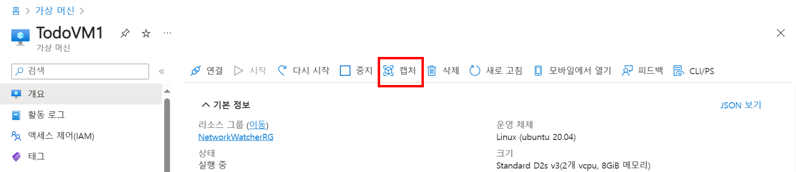

# (추가) VMSS

Advanced 리소스가 생성되어 있어야 합니다.

## 가상 머신 이미지 생성

1. 포털에서 가상 머신 메뉴로 이동 후 `TodoVM1`을 선택합니다.
2. 상단 메뉴에서 `캡처`를 클릭합니다.
    
    
    
3. 아래와 같이 설정 후 `검토 + 만들기` 버튼을 클릭합니다.
    - 리소스 그룹 : BasicWorkshopRG
    - `이미지를 만든 후 이 가상 머신을 자동으로 삭제` 체크 박스를 클릭
    - 갤러리 세부 정보
        - 대상 Azure Compute Gallery : 새로 만들기 클릭 후, DefaultComputeGallery 입력
    - 대상 VM 이미지 정의 : `새로 만들기` 클릭
        - VM 이미지 정의 이름 : TodoVM
        - `확인` 버튼 클릭
    - 버전 번호 : 0.0.1
    - 단순 복제 체크 박스 클릭
    - 기본 스토리지 SKU : 프리미엄 SSD LRS

## VMSS 만들기

1. 포털에서 VMSS 메뉴로 이동합니다.
2. 상단에 `만들기` 버튼을 클릭합니다.
3. 아래와 같이 설정합니다.
    - 리소스 그룹 : BasicWorkshopRG
    - 가상 머신 확장 집합 이름 : TodoVMSS
    - 지역 : (Asia Pacific) Korea Central
    - 오케스트레이션 모드 : 유연한
    - 이미지 : `모든 이미지 보기` 클릭
        - 기타 항목에서 공유 이미지 선택
        - 생성한 `TodoVM` 이미지를 선택
        
        
        
4. `네트워킹` 탭으로 이동합니다.
5. 가상 네트워크를 `BasicVNet`으로 설정합니다.
6. `확장 중` 탭으로 이동합니다.
    - 초기 인스턴스 수가 2개로 구성된 것을 확인
7. `검토 + 만들기` 버튼을 클릭합니다.
    
    

## 부하 분산 장치 구성

1. 포털에서 부하 분산 장치 메뉴로 이동합니다.
2. `todoLB`를 선택합니다.
3. 왼쪽 메뉴에서 `백 엔드 풀`을 클릭합니다.
4. `TodoBackend`를 선택합니다.
5. IP 구성 섹션에서 `추가` 버튼을 클릭합니다.
6. 가상 머신 확장 집합 섹션에서 `TodoVMSS`를 선택하고 `추가` 버튼을 클릭합니다.
    
    
    
7. 기존 VM의 구성이 남아있다면 이를 삭제하고 `저장` 버튼을 클릭합니다.

## TodoVMSS 네트워킹 구성

1. 포털에서 VMSS 메뉴로 이동합니다.
2. 왼쪽 메뉴에서 네트워킹을 선택합니다.
3. 네트워크 인터페이스를 확인한 뒤, `인바운드 포트 규칙 추가` 버튼을 클릭합니다.
4. 아래와 같이 보안 규칙을 구성 후 `추가` 버튼을 클릭합니다.
    - 소스 : Any
    - 원본 포트 범위 : *
    - 대상 주소 : Any
    - 서비스 : HTTP
    - 작업 : 허용
5. 부하 분산 장치의 프런트 엔드 IP를 통해 서비스에 정상 액세스 되는지 확인합니다.