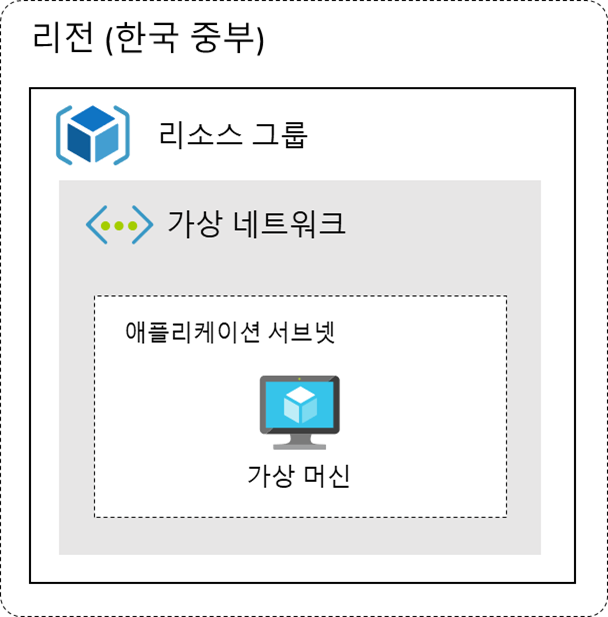

# Azure Basic Workshop

# 웹 애플리케이션 배포하기



이번 실습에서는 애저에서 가장 기본적인 형태의 웹 애플리케이션을 배포하는 방법에 대해 알아보도록 하겠습니다. 가상 머신에 웹 애플리케이션을 배포하고 웹 애플리케이션의 데이터를 관리하기 위한 SQL 데이터베이스를 구성해 보도록 하겠습니다. 부하 분산 장치의 프런트 엔드 IP를 웹 애플리케이션을 진입점으로 사용하고 가상 머신을 백 엔드 풀로 사용합니다. 이렇게 구성하면 웹 애플리케이션을 논리적으로 격리할 수 있으며, 추후 애플리케이션의 확장을 고려한 아키텍처를 설계할 수 있습니다.

### 실습 내용

- 가상 네트워크 만들기
- 웹 애플리케이션 배포
    - 가상 머신 만들기
    - 웹 애플리케이션 배포
    - 배포 테스트
- 부하 분산 장치 만들기
- SQL 데이터베이스 만들기
    - SQL 데이터베이스 연동

## 가상 네트워크 만들기


1. 왼쪽 상단 검색창에서 가상 네트워크 입력하여 가상 네트워크 화면으로 이동합니다.
2. 만들기 버튼을 클릭합니다.
3. 아래와 같이 구성하고 다음: IP 주소 버튼을 클릭합니다.


- 구독 : 생성한 구독 선택
- 리소스 그룹 : 새로 만들기 버튼 클릭 후, BasicWorkshopRG 입력하고 확인 버튼 클릭
- 이름 : BasicVNet
- 지역 : KoreaCentral

1. 아래와 같이 구성된 것을 확인하고 검토 + 만들기 버튼을 클릭합니다.


1. 만들기 버튼을 클릭하여 가상 네트워크를 생성합니다.

## 웹 애플리케이션 배포


### 가상 머신 만들기

1. 왼쪽 상단 검색창에서 가상 머신 입력하여 가상 머신 화면으로 이동합니다.
2. 만들기 버튼을 클릭하고 Azure 가상 머신을 선택합니다.


1. 아래와 같이 구성하고 나머지 설정은 그대로 두고 검토 + 만들기 버튼을 클릭합니다.


- 구독 : 생성한 구독 선택
- 리소스 그룹 : BasicWorkshopRG
- 가상 머신 이름 : TodoVM
- 지역 : (Asia Pacific) Korea Central

1. 만들기 버튼을 클릭합니다. 새 키 쌍 생성 화면이 뜨면 프라이빗 키 다운로드 및 리소스 만들기 버튼을 클릭합니다.


### 웹 애플리케이션 배포

애저 클라우드 쉘을 사용하여 웹 애플리케이션을 배포해 보도록 하겠습니다. 애저 클라우드 쉘은 애저 리소스를 관리하기 위한 인증된 대화형 브라우저 액세스 터미널입니다.

1. [https://shell.azure.com/](https://portal.azure.com/#cloudshell/)에 접속합니다. 클라우드 쉘 설정은 아래 URL을 참고합니다.
- [https://learn.microsoft.com/ko-kr/azure/cloud-shell/overview](https://learn.microsoft.com/ko-kr/azure/cloud-shell/overview)

1. 왼쪽 상단에서 쉘 환경을 Bash로 변경합니다.


1. 파일 업로드 버튼을 클릭하여 다운로드 받은 프라이빗 키를 업로드 합니다.


1. 업로드된 프라이빗 키를 읽기 전용 액세스 권한으로 변경합니다.

```bash
chmod 400 <keyname>.pem
```

1. 아래 명령어를 사용하여 가상 머신에 연결합니다.

```bash
ssh -i <keyname>.pem azureuser@<vm-ip>
```

1. 아래 명령어를 사용하여 깃허브에서 todoapp 리포지토리를 복제합니다.

```bash
git clone https://github.com/Anna-Jeong-MS/TodoApp.git
```

1. todoapp을 실행하기 위해 몇 가지 파이썬 종속성을 설치해야 합니다. 파이썬 종속성 설치하기 위해 파이썬 종속성을 설치하기 위한 도구인 pip를 설치합니다.

```bash
sudo apt update && sudo apt install python3-pip
```

1. 정상적으로 설치되면 아래 명령어를 통해 설치된 버전을 확인할 수 있습니다.

```bash
pip --version
```

1. 이제 todoapp을 실행하기 위한 종속성을 다운로드 받습니다.

```bash
sudo pip install fastapi && sudo pip install "uvicorn[standard]"
```

1. 아래 명령어를 사용하여 애플리케이션을 실행합니다.

```bash
cd AzureBasicWorkshop/todoapp/ && sudo uvicorn main:app --host 0.0.0.0 --port 80 > /dev/null 2>&1 &
```

1. 테스트를 위해 가상 머신에 80번 포트의 연결을 허용하는 인바운드 포트 규칙을 추가해 보도록 하겠습니다. 이 규칙은 부하 분산 장치를 만들고 나면 해당 부하 분산 장치를 통해서 들어오는 트래픽만 허용하도록 수정할 것 입니다.
    
    애저 포털에서 가상 머신 화면으로 이동 후, 생성한 TodoVM을 선택하고 왼쪽 네트워킹 메뉴를 클릭합니다.
    
2. 인바운드 포트 규칙에서 인바운드 포트 규칙 추가 버튼을 클릭하고 아래와 같이 설정하고 추가 버튼을 클릭합니다.


### 배포 테스트

1. TodoVM에서 개요 메뉴를 클릭합니다.
2. 공용 IP 주소를 복사합니다.


1. 브라우저에서 새 탭을 열고 복사한 공용 IP 주소를 붙여넣습니다. 다음과 같은 화면이 뜨면 정상적으로 배포가 완료된 것입니다.


## 부하 분산 장치 만들기

1. 왼쪽 상단 검색창에서 부하 분산 장치 입력하여 부하 분산 장치 화면으로 이동합니다.
2. 만들기 버튼을 클릭합니다.
3. 아래와 같이 구성합니다.


- 구독 : 생성한 구독 선택
- 리소스 그룹 : BasicWorkshopRG
- 이름 : todoLB
- 지역 : Korea Central
- SKU : 표준
- 형식 : 공개
- 계층 : 지역
1. 다음: 프런트 엔드 IP 구성 버튼을 클릭합니다.
2. 프런트 엔드 IP 구성 추가 버튼을 클릭하고 아래와 같이 구성 후, 추가 버튼을 클릭합니다.


todoPublicIP
- 이름 : todoPublic
- IP 버전 : IPv4
- IP 유형 : IP 주소
- 공용 IP 주소 : 새로 만들기 버튼 클릭
    - 이름 : todoPublicIP

1. 다음: 백 엔드 풀 버튼을 클릭하고 백 엔드 풀 추가를 클릭합니다.
2. 아래와 같이 구성하고 저장 버튼을 클릭합니다.


- 이름 : TodoBackend
- 가상 네트워크 : BasicVNet(BasicWorkshopRG)
- IP 구성
    - 추가 버튼을 클릭하여 TodoVM 선택

1. 다음: 인바운드 규칙 버튼을 클릭합니다.
2. 부하 분산 규칙을 생성하여 적용해 보도록 하겠습니다. 부하 분산 규칙 추가 버튼을 클릭하고 다음과 같이 구성합니다.


1. 상태 프로브는 백 엔드 풀의 정상 상태를 확인합니다. 상태 프로브에서 새로 만들기를 클릭하고 다음과 같이 설정하고 확인 버튼을 클릭합니다.


1. TodoRule이 정상적으로 추가된 것을 확인한 뒤, 검토 + 만들기 버튼을 클릭하고 만들기 버튼을 클릭하여 부하 분산 장치를 생성합니다.

### 인바운드 포트 규칙 수정

1. 애저 포털에서 가상 머신 화면으로 이동 후 TodoVM을 클릭합니다.
2. 왼쪽 네트워킹 메뉴에서 이전에 생성한 80번 포트 규칙을 클릭합니다.
3. 아래와 같이 규칙을 수정하고 저장 버튼을 클릭합니다.


1. 부하 분산 장치의 프런트 엔드 IP를 복사하여 새 탭에 붙여넣고 정상 동작을 확인합니다.

## SQL 데이터베이스 만들기

1. 왼쪽 상단 검색창에서 SQL 데이터베이스 입력하여 SQL 데이터베이스 화면으로 이동합니다.
2. 만들기 버튼을 클릭합니다.


1. 아래와 같이 구성합니다.


- 구독 : 생성한 구독 선택
- 리소스 그룹 : BasicWorkshopRG
- 데이터베이스 이름 : TodoDB
- 서버 : 새로 만들기 클릭

1. SQL Database 서버 만들기 화면이 나타나면 아래와 같이 구성하고 확인 버튼을 클릭합니다.


- 서버 이름 : basic-workshop
- 위치 : (Asia Pacific) Korea Central
- 인증 방법 : SQL 인증 사용
    - 서버 관리자 로그인 : db-admin
    - 암호 : Todo123!@

1. 나머지 설정은 그대로 두고, 검토+만들기 버튼을 클릭합니다. 다음과 같은 화면이 뜨면 구성 내용을 확인하고 만들기 버튼을 클릭합니다.

