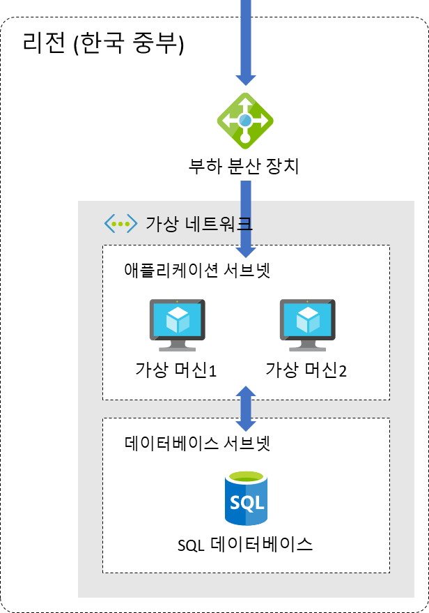

# Azure Basic Workshop

Azure Basic Workshop은 애저 인프라 코어 서비스들을 직접 Hands on Lab 할 수 있는 컨텐츠입니다. 소요 시간에 따라 Basic / Advanced 두 가지 컨텐츠로 구성되어 있습니다. Basic의 경우 약 한 시간, Advanced의 경우 약 두 시간이 소요됩니다.

## 컨텐츠

[Basic](https://github.com/Anna-Jeong-MS/AzureBasicWorkshop/tree/main/basic)

  

  애저의 가장 기본적인 서비스인 가상 네트워크와 가상 머신을 활용하여 웹 애플리케이션을 배포합니다. 가상 네트워크를 구성하고 그 가상 네트워크에 가상 머신을 생성하여 웹 애플리케이션을 배포합니다.

[Advanced](https://github.com/Anna-Jeong-MS/AzureBasicWorkshop/tree/main/advanced)

  

  가상 머신에 웹 애플리케이션을 배포하고 웹 애플리케이션의 데이터를 관리하기 위한 SQL 데이터베이스를 구성합니다. 부하 분산 장치의 프런트 엔드 IP를 웹 애플리케이션을 진입점으로 사용하고 가상 머신을 백 엔드 풀로 사용합니다. 이렇게 구성하면 웹 애플리케이션을 논리적으로 격리할 수 있으며, 추후 애플리케이션의 확장을 고려한 아키텍처를 설계할 수 있습니다.

## 샘플 코드

```bash
git clone https://github.com/Anna-Jeong-MS/TodoApp
```
