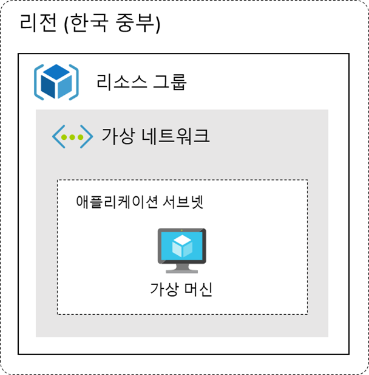

# Basic



이번 실습에서는 애저의 가장 기본적인 서비스인 가상 네트워크와 가상 머신을 활용하여 웹 애플리케이션을 배포해 보도록 하겠습니다. 가상 네트워크를 구성하고 그 가상 네트워크에 가상 머신을 생성하여 웹 애플리케이션을 배포해 보도록 하겠습니다.

### 실습 내용

- 리소스 그룹 만들기
- 가상 네트워크 만들기
- 가상 머신 만들기
- 베스천 만들기
- 웹 애플리케이션 배포
- 구성 테스트

## 리소스 그룹 만들기

  

리소스 그룹은 Azure 솔루션에 관련된 리소스를 보유하는 컨테이너입니다. 모든 애저의 리소스들은 이 리소스 그룹에 할당되게 됩니다. 먼저 저희가 배포할 워크로드 리소스들을 관리할 리소스 그룹을 생성해 보도록 하겠습니다.

1. 애저 포털([https://portal.azure.com/](https://portal.azure.com/))에 접속합니다.

  

2. 상담 검색 메뉴에서 리소스 그룹 검색해서 리소스 그룹 화면으로 이동합니다.
3. 만들기 버튼을 클릭합니다.
4. 아래와 같이 구성 후, 검토 + 만들기 버튼을 클릭합니다.

  

- 구독 : 사용할 구독 선택
- 리소스 그룹 : BasicRG
- 영역 : (Asia Pacific) Korea Central

5. 유효성 검사를 통과하면 만들기 버튼을 클릭하여 리소스 그룹을 만듭니다.

## 가상 네트워크 만들기

  

애저 가상 네트워크(VNet)는 애저에서 제공하는 프라이빗 네트워크의 기본 구성 요소입니다. VNet을 사용하면애저 가상 머신과 같은 다양한 형식의 애저 리소스가 서로, 그리고 인터넷 및 특정 온-프레미스 네트워크와 안전하게 통신할 수 있습니다. VNet은 자체 데이터 센터에서 운영하는 기존 네트워크와 유사하지만, 확장, 가용성 및 격리와 같이 애저 클라우드 인프라에서 제공하는 이점을 추가로 활용할 수 있습니다.

1. 상단 검색 메뉴에서 가상 네트워크 를 입력해서 가상 네트워크 화면으로 이동합니다.
2. 만들기 버튼을 클릭합니다.
3. 기본 사항 탭을 아래와 같이 구성하고 다음: IP 주소 > 버튼을 클릭합니다.

  

- 구독 : 사용할 구독 선택
- 리소스 그룹 : BasicRG
- 이름 : BasicVNet
- 지역 : Korea Central

4. 아래 서브넷 구성 영역에서 default 서브넷을 클릭하여 아래와 같이 수정하고 저장합니다.

  

- 서브넷 이름 : application-subnet

5. 나머지 설정은 그대로 두고 검토 + 만들기 버튼을 클릭합니다.

## 가상 머신 만들기

  

1. 상단 검색 메뉴에서 가상 머신을 입력해서 가상 머신 화면으로 이동합니다.
2. 만들기 버튼을 클릭하고 Azure 가상 머신을 선택합니다.

  

3. 빨간색 박스 부분을 아래와 같이 구성하고 나머지는 그대로 두고 상단 네트워킹 탭을 클릭합니다.

  

- 구독 : 사용할 구독 선택
- 리소스 그룹 : BasicRG
- 가상 머신 이름 : BasicVM
- 지역 : (Asia Pacific) Korea Central
- 이미지 : Ubuntu Server 20.04 LTS - x64 Gen2

4. 다음과 같이 저희가 생성한 BasicVNet에 배포되는 것을 확인하고 검토 + 만들기 버튼을 클릭합니다.

  

5. 이 때 생성되는 새 키 쌍 생성 화면에서 프라이빗 키 다운로드 및 리소스 만들기를 클릭하여 프라이빗 키를 다운로드 받습니다. 나중에 이 키를 사용하여 가상 머신에 접속하게 됩니다. 다운로드 받은 프라이빗 키를 적절한 경로로 이동해 줍니다.

  

6. 배포가 끝나면 리소스로 이동 버튼을 클릭합니다.

## 웹 애플리케이션 배포

### 베스천 배포하기

1. **가상 머신 화면**에서 **BasicVM**을 클릭하고, 왼쪽 **베스천** 메뉴를 클릭합니다.
2. **Bastion 배포** 버튼을 클릭합니다.

  

### 웹 애플리케이션 배포

베스천을 사용하여 웹 애플리케이션을 배포해 보도록 하겠습니다.

1. 베스천이 생성되면 아래 정보를 입력하고 연결 버튼을 클릭합니다.

  

2. 아래 명령을 실행하여 GitHub에서 샘플 애플리케이션을 복제합니다.

```bash
git clone https://github.com/Anna-Jeong-MS/BasicApp.git
```

  

3. 웹 애플리케이션 실행을 위해 몇 가지 종속성을 다운로드 받아야 합니다. 아래 명령어를 사용하여 종속성을 다운로드 받고 웹 애플리케이션을 실행합니다.

```bash
# pip 설치
sudo apt update && sudo apt install python3-pip

# 종속성 설치
cd BasicApp
sudo pip install -r requirements.txt

# 웹 애플리케이션 실행
sudo uvicorn main:app --host 0.0.0.0 --port 80 > app.log 2>&1 &
```

  

### 보안 그룹 수정

1. 다시 포털로 돌아와서 생성한 가상 머신을 선택합니다.
2. 왼쪽 메뉴에서 네트워킹 메뉴를 선택합니다.
3. 인바운드 포트 규칙 추가 버튼을 클릭하고 다음과 같이 구성 후 추가해 줍니다.

  

- 소스 : Any
- 원본 포트 범위 : *
- 대상 주소 : Any
- 서비스 : HTTP

## 구성 테스트

1. 왼쪽 개요 탭을 선택합니다.
2. 기본 정보에서 공용 IP 주소를 복사합니다.

  

3. 브라우저에서 새 탭을 열어 복사한 공용 IP 주소를 붙여넣기 해줍니다.

  

고생하셨습니다 🙂