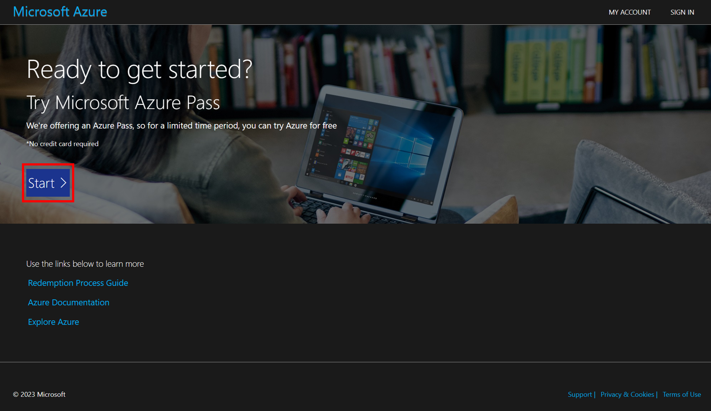

# Prerequisite

## Azure Pass 활성화

1. [https://www.microsoftazurepass.com/](https://www.microsoftazurepass.com/) 에 접속합니다.
    
    * 브라우저에 Azure 자동 로그인이 되어 있는 경우, 브라우저의 **인프라이빗 모드**를 사용해 주세요.
    
2. 화면의 Start 버튼을 클릭합니다.
    
    
    
3. (중요) 이 때 꼭 학교나 회사 계정이 아닌 **“개인 계정”**을 사용하셔야 합니다.
4. 로그인이 되면 아래 화면이 보입니다. 아래 화면에서 Confirm Microsoft Account 버튼을 클릭합니다.
    
    
    
5. Enter Promo code: 입력 상자에 관리자에게 전달 받은 프로모 코드를 입력합니다.
6. CAPTCHA를 입력하고 Submit 버튼을 클릭합니다.
    
    
    

## Azure 사용자 생성

1. 애저 포털([https://portal.azure.com/](https://portal.azure.com/))에 접속합니다.
2. 상단 메뉴 검색에서 Entra ID를 검색하여 결과에서 Microsoft Entra ID 를 클릭합니다.
3. 왼쪽 메뉴에서 사용자를 클릭합니다.
4. 새 사용자 버튼을 클릭하고 새 사용자 만들기를 선택합니다.
5. 사용자 정보를 입력하고 검토 + 만들기 버튼을 클릭합니다.
    
    
    
6. 필요한 사용자 수 만큼 4~5단계를 반복합니다.